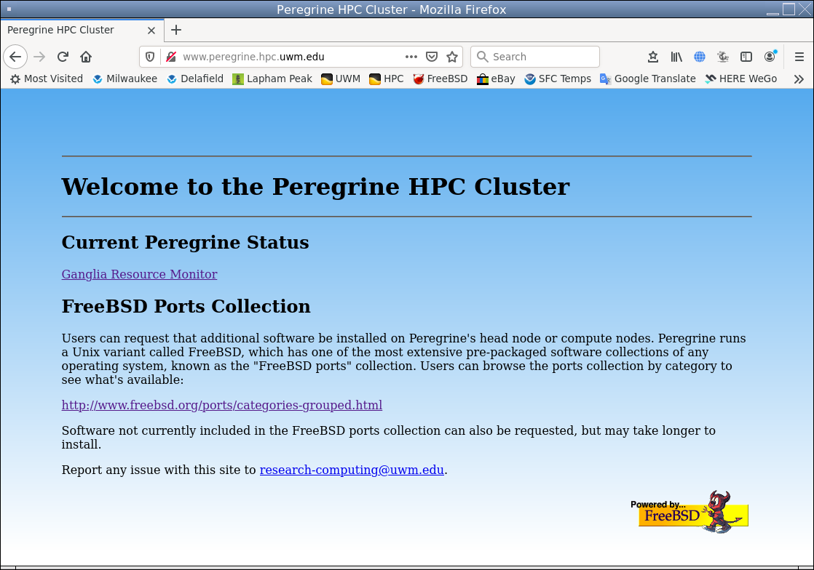

# SPCM

## Overview

SPCM (Simple, Portable Cluster Manager is a free), open source integrated tool set for
managing a simple HPC (High Performance Computing) cluster.

It is the only portable cluster management suite we are aware of and is
designed to be easily adapted to most POSIX platforms.

SPCM automates the process of configuring a head node, compute nodes, file
servers, and visualization nodes. Most common management tasks can be
performed using a simple menu interface, while additional tasks are supported
by command-line tools.

SPCM automatically installs and integrates the LPJS scheduler and the
Apache web server, ready to accommodate the monitoring system of your
choice (Nagios, Munin, Prometheus, etc.)

Developed by Jason W. Bacon and James F. Wagner

## Features

-   Simple menu interface for most common operations
-   Fast, easy installation and node deployment
-   Designed for portability to any POSIX platform
-   Remote power control using IPMI

## Images

## Design

The design philosophy centers on simplicity and performance.  These ideals are
achieved in-part by minimizing interdependence of cluster nodes.  Each
compute node contains a fully independent operating system
installation and critical software installations on its own local
storage.  Compared with clusters that utilize shared storage more extensively,
this strategy increases cluster setup and maintenance time slightly in
exchange for simpler management, less "noise" on the local network, fewer
single points of failure, and fewer bottlenecks.

-   Simplicity: Efforts are focused on objective measures such as reliability,
    speed, easy management.  No peacock feathers that would drain man-hours
    from improving functionality and add needless complexity and more bugs.
    We intend to keep the "Simple" in SPCM and will not let it fall victim to
    creeping feature syndrome.

-   Portability: SPCM should be easy to port to any
    POSIX operating system.  This is a challenge given the differences in
    sysadmin tools across various POSIX systems, but the basic design
    minimizes barriers to supporting different tools.
    The long-term plan is to support heterogeneous clusters, where
    different nodes can opaquely run different operating systems, while being
    managed with the same tools.  There is currently limited
    support for this and using FreeBSD file servers and visualization nodes

-   Non-interference with core operating system: Unlike many cluster
    management systems, SPCM does not depend on hacks to the
    base operating system, but sits on top of the standard base system and
    package manager for each OS.  Critical security updates
    just released for your OS?  Install them immediately without fear
    of breaking your cluster: You don't have to wait for us to update a
    custom OS image, leaving your cluster vulnerable in the meantime.

-   SPCM clusters never need to be shut down: All system updates can be
    applied to a live cluster. Compute nodes are set to draining state and
    updated when they become idle. The head node, file servers, and
    visualization nodes can all be updated and rebooted via the menu
    interface without adversely affecting running jobs.

Implementation of this design is facilitated by leveraging the
systems management tools provided by the base system, including
native package managers and cross-platform package managers.

The SPCM tools are written almost entirely in POSIX Bourne shell
using standard Unix tools to configure the system, and utilizing
ports/packages for all software management.

## Network Topology

From a networking perspective, a typical HPC cluster is a LAN (Local Area
Network): A group of computers on a private network behind a router configured
with NAT (Network Address Translation).  The difference between your home
or office LAN and an HPC cluster is in the power of the nodes, the speed

In theory, an HPC cluster could simply be a subset of nodes on a
general-purpose network.  However,
using a dedicated switch behind a router isolates all the cluster network
traffic, which will improve performance for file server access and parallel
program communication, while also eliminating impact on the outside network.

In many clusters,
the head node is multi-homed (has two network interfaces) and serves as
the gateway for the cluster.  SPCM allows for this configuration,
but be aware that it complicates the setup of the head node as well
as configuration of many services running

The recommended hardware configuration uses a single network interface on
every node, including the head node, a separate router/gateway, and a
dedicated switch for all cluster traffic.  Many modern network switches have
built-in routing capability and can serve as both router and local switch.
If you're using a simple switch without routing capability for your cluster,
you can use an inexpensive hardware router or quickly and cheaply build a
sophisticated firewall router using any PC with two network adapters and
<a href="https://opnsense.org/">OPNsense</a>.

A dedicated router appliance is also easier and likely more secure than
a head node configured as a gateway.  Tools like pfSense are written and
maintained by networking experts and provide a convenient web interface
for configuration.

In addition, this topology allows direct connection from outside the cluster
to any node via port forwarding with different TCP ports.  No need to run
additional cables to isolate large transfers to/from the file servers.
For example,
incoming SSH connections on port 22 can be routed to the head node, while
connections on port 22001 can route to a file server.  In this way, the head
node is spared the network load of file transfers, which can annoy interactive
users.  On a large cluster, you can use faster network interfaces on both the
WAN and LAN side of the router to support the full bandwidth of multiple
servers within the cluster.  E.g., if your cluster nodes all use gigabit
interfaces, using 10 GbE on the router will support multiple file transfers
to/from different servers at full gigabit speed while still leaving plenty
of bandwidth for the head node.

If you plan to use the SPCM PXE installer for non head nodes, you'll probably
want to disable the DHCP server on the router.  SPCM can automatically
configure your head node as a DHCP and PXE server.

It's best to keep the load on the head node as low as possible to ensure
snappy response times for shell sessions and for the scheduler.  Hence, the
head node should not double as a compute node or as a file server for
large amounts of data.  We generally house /home on the head node so that it
is fully functional even when all other nodes are down, but
with a very small quota (e.g. 250 MiB).  Scientific data are stored on
separate file servers so that heavy network traffic and disk loads are
isolated.

A compute node can double as a file server and this has the advantage that jobs
running on that node have direct access to the disks rather than using the
network via NFS, Gluster, etc.  If you do this, be aware that ZFS by default
will consume most or all available RAM, thus competing with computational
processes.  To prevent performance problems, you can limit
ZFS adaptive read cache (ARC) to a few gigabytes and subtract the same
amount from RealMemory for that node in your slurm.conf.

Accessing the head node and file servers via NFS may mean cross-mounting them
(each is an NFS server for the other), which can cause a deadlock during boot
while each waits for the other to enable NFS.  On FreeBSD, this issue is
easily solved
using background mounting (bg flag in /etc/fstab).  Note, however, that
background mounting does not work on RHEL/CentOS 7 due to incompatibilities
with systemd, so if you cross-mount, you
will need a more complex setup using autofs or the noauto mount flag + a cron
job for late mounting.

Visualization nodes should be considered a tool for quick-and-dirty viewing
of results.  For more sophisticated viewing, users should download the data
to a workstation where they can utilize the local display for best graphics
performance.

The head node and file servers should generally be on battery back-up, but
not the compute nodes.  Keeping compute nodes running through a power outage
would require a truckload of batteries for a large cluster and greatly reduce
battery run-time for even a very small cluster.

The head node need not be powerful, but should be very reliable. For large
clusters,
it is recommended that the head node have redundant power supplies and boot
from a RAID with hot swappable disks.  ZFS can be utilized to construct a
RAID without the
need for a hardware RAID controller, though replacing disks in a software
RAID is a little more involved.  SLURM may use a fair amount of RAM on the head
node of a large, busy cluster, but does not need much CPU.

For a small personal cluster, a laptop actually makes a pretty good head node
with its built-in battery backup, keyboard, and monitor.

File servers should be similarly reliable, with redundant power supplies and
RAID.  You may want to equip them with faster network interfaces than the
compute nodes, as they may be greatly outnumbered, or a gigabit network
interface may be a bottleneck next to the RAID capability.  Our benchmarks showed
little difference in performance between SAS and SATA disks.  If you use SATA,
however, be sure that they are server-grade.  Low-end SATA disks designed for
PCs may not offer the same performance or may not be rated for use in large
RAIDs due to vibrational characteristics.  File servers should have plenty
of RAM for buffering to allow reordering of I/O operations.  A few fast
processors will serve better than many slower ones in most settings.

Don't obsess about hardware specs.  Predicting the optimal CPU and memory
configuration for the variety of programs that will run on the cluster is
impossibly complex.  Be content that you are reducing weeks, months, or
years of computation time to hours or days in any case, and go with what
looks like the most cost-effective CPUs and RAM.  Doubling the cost
of a cluster for the 20% gain in speed you get from the latest-and-greatest
processors is usually nothing but foolish ego fodder.

Do choose an expandable configuration, e.g. don't fill all of your memory
slots right away, in case you find out more RAM is needed later.  Four
16 GiB chips may cost a little more than eight 8 GiB chips, but filling all
your DIMM slots with 8 GiB chips will backfire later if you have to replace
them all in order to increase total RAM.

Maximizing rack density is also generally a good idea for multiple
reasons.  Compute nodes with a higher core count save capital costs on
both the servers and rack space,
save energy, and reduce network load since processes running on the same node
can communicate through local memory rather than the network.

Resources for compute nodes should be put toward CPU and RAM.  Redundant
power supplies are of little use unless interruption of jobs would be
catastrophic in your setting.  Maximizing MIPS/$ is usually a good strategy
for general-use clusters, so the highest-end CPUs are usually not a good
value.  16 medium-speed cores will generally be a better value than 8
high-speed cores, unless you need to run many jobs that don't scale well to
large numbers of processes.

## Currently Supported Platforms: FreeBSD and RHEL family

Redhat Enterprise Linux (RHEL) and it's derivatives are the de facto
standard operating systems for HPC clusters.
They are more stable than bleeding-edge Linux distributions, have strong support
for HPC system
software like Infiniband drivers, parallel file systems, etc., and are the
only POSIX platforms officially supported by most commercial scientific
software vendors.

The main disadvantages of enterprise Linux platforms (compared to FreeBSD or
community Linux distributions such as Debian and Gentoo) are use of outdated
kernels and packages available in the Yum repository.  (Stability and
long-term binary compatibility in enterprise Linux systems is maintained
by running older, time-tested, and heavily patched versions of system
software.)

FreeBSD's unparalleled reliability, near-optimal efficiency, and easy software
management via the FreeBSD ports collection make it an ideal platform for HPC
clusters. There is no better platform for running scientific software that
requires modern development tools or lengthy uninterrupted up time.  FreeBSD
is the only operating system we've found that offers enterprise reliability and
system management features (binary updates, fully-integrated ZFS, etc)
combined with top-tier development tools and software management (Clang/LLVM
base compiler, FreeBSD ports, etc.).

An example of FreeBSD's reliability is provided by Peregrine, a FreeBSD
HPC cluster built for educational use at the University of Wisconsin --
Milwaukee.  Peregrine has never had a node crash or freeze
in the absence of a hardware problem in 8 years of service, despite running
some extremely intensive jobs that caused outages on other clusters.
The only reliability issues encountered were a few head node crashes, traced
to a Dell PowerEdge firmware bug affecting single-processor systems, and
a compute node crash caused by a bad memory slot.

FreeBSD is the basis of many products used in HPC including FreeNAS, Isilon,
NetApp, OPNSense, Panasas, and pfSense.

Many FreeBSD HPC clusters are in use today, serving science, engineering,
and other disciplines.  FreeBSD is a supported platform on Amazon's EC2
virtual machine service.  It is also a little-known fact that the
special effects for the movie "Matrix" were rendered on a FreeBSD cluster.

FreeBSD can run most Linux binaries natively (with better performance than
Linux in some cases), using its CentOS-based Linux compatibility module.
This module is *NOT* an emulation layer.  It simply adds Linux system calls
to the FreeBSD kernel so that it can run Linux binaries directly.  Hence,
there is no performance penalty.  The only added cost is a small kernel
module and modest amount of disk used to house the module and Linux software.

## Required Skills

-   Unix systems management and security (ssh setup, filesystem management,
    user management, software installs, etc)
-   Basic networking (host configuration, router setup, LAN, port forwarding,
    DHCP server)
-   NFS server and client configuration
-   Basic web server configuration

## Quickstart

Do a basic RHEL minimal or FreeBSD installation on your head node.
Configure the network as desired.  Either place all nodes behind a separate
gateway (recommended) or configure the head node as a gateway (somewhat
more involved, see Design tab).  A LAN address of 192.168.x.2 is recommended
for the head node.  Be sure to choose a LAN IP range that does not overlap
with the WAN.

On FreeBSD, ZFS is recommended for the head node unless is has less than
4GB RAM, and for all file servers.  UFS2 is recommended for compute nodes
since it requires far less RAM than ZFS, leaving more for your scientific
computations.

Download and run the spcm-bootstrap script from this repository
to begin head node setup.

Once the head node is bootstrapped, run cluster-node-admin and follow the menu
options for installing and configuring nodes beginning with the head node.

File servers should generally be done before compute nodes if possible,
so that the compute node NFS mounts can be configured automatically during
setup.

## Using the PXE installer

Run auto-pxe-node-discover ("PXE install new nodes" from the Node management
menu of SPCM) BEFORE booting new nodes for PXE installation, and complete
the DHCP configuration of each
new node before it reboots following install (usually by simply accepting the
defaults offered by auto-pxe-node-discover).  This will permanently reserve
the first IP address granted to node MAC in dhcp.conf.

Otherwise, the DHCP server may create duplicate leases for the same MAC
address on subsequent boots.  This will require stopping the DHCP server and
manually cleaning up the MAC/IP links in dhcp.leases, dhcp.conf, and
/etc/hosts.  The cluster-dhcp-cleanup script can be used to do this in an
orderly fashion.

Any nodes not installed by the PXE system will have to be manually configured
to accept password-less ssh from the head node.  Set
PermitRootLogin=prohibit-password in sshd_config to allow this without
compromising security.

The default PXE installer script is designed to be minimalist so you can quickly
get multiple nodes up and running (and spend minimal time in the data center).
New nodes are accessible from the head node, but have very little software
installed.
Subsequent steps can be performed remotely from the comfort of your office.

The "Initialize new nodes" option installs basic system software, updates
the OS, and reboots.  The menu system allows you to select a batch of any
number of nodes to initialize unattended.

The final step, "Synchronize nodes", is done after initializing and rebooting
(and possibly after a node has been offline for an extended period and needs
to catch up to the other nodes on software installs and updates).

One node of each type (file server, visualization, compute) must be manually
configured in this step to set up NFS mounts, etc.  Subsequent nodes can
be synchronized unattended using the configuration of the first.

While synchronizing one set of nodes (e.g. 10 or 20), you can run the
initialization step on the next set.  By overlapping configuration this way,
you can reduce the waiting time for configuring all nodes.  You might ask
"why not sync multiple nodes in parallel?".  The main reason is that doing
so would overwhelm the network while downloading packages and updates.

